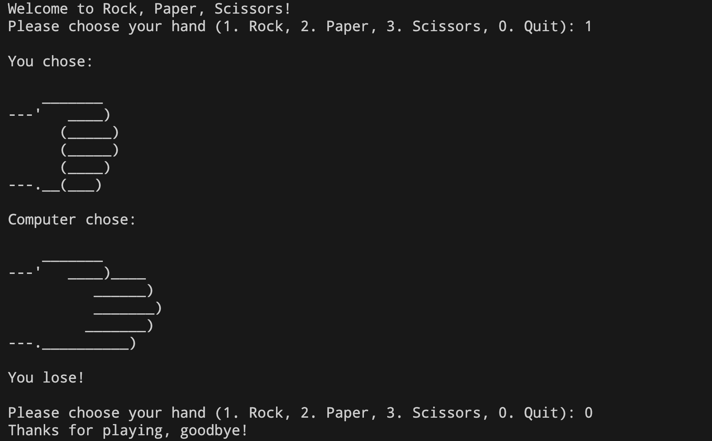
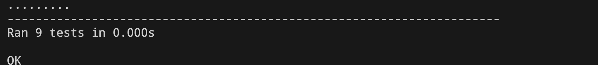

# Rock Paper Scissors

A simple command-line game of Rock, Paper, Scissors built with Python. This project was done as a project while working on the 100 days of Python course on Udemy. Currently have 
a trial of Github Copilot, so was utilizing some of that in Visual Studio Code while working on this small project.

 

## Example Gameplay

 

## Running Tests

To run the unit tests:
`python3 test.py`

 

## File Overview
- `main.py` - Main game logic
- `hands.py` - Hand representations
- `test.py` - Unit tests

