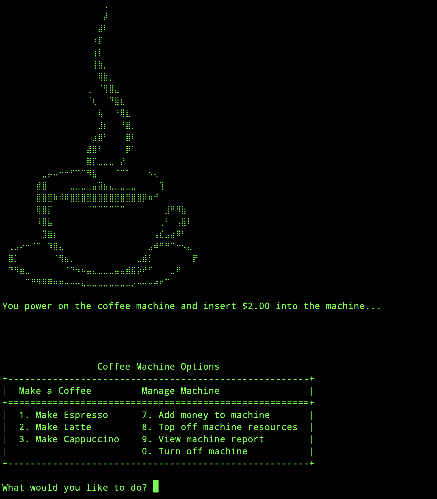
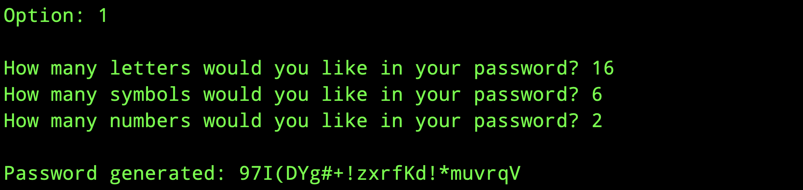
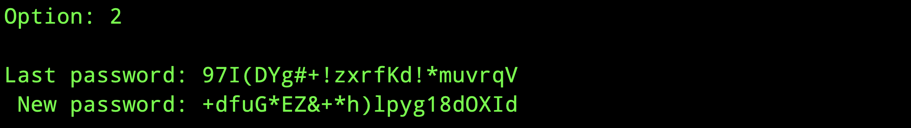
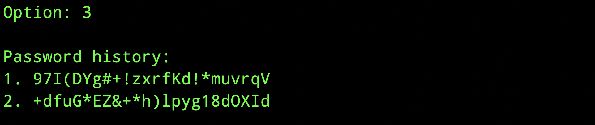

# PyPassword Generator

A command-line application in Python that helps you generate secure passwords tailored to your preferences. You can control the number of letters, symbols, and numbers in the password, and manage a history of recently generated passwords for easy reference.

### Online Demo's Here:
https://trinket.io/python3/b4a4884af792?outputOnly=true&runOption=run

## Features

- Customizable Passwords:
  - Generate passwords by specifying how many letters, symbols, and numbers you want.
- Password History Management:
    - Keep track of the last five generated passwords.
    - Clear the password history whenever needed.
- Regenerate Passwords:
    - Easily regenerate the most recent password.
- User-Friendly CLI:
    - Simple menu-driven interface to interact with the program.

## Screenshots









## How to Install
1. Clone the repository:
    ```bash
    git clone https://github.com/JasonY199/pypassword-generator

    cd pypassword-generator
    ```

2. Ensure Python is installed:<br>
    This application requires Python 3.x.

3. Run the application:
    ```bash
    python main.py
    ```

## How to Use


1. Main Menu Options:<br>
    1: Generate a new password by entering the desired number of letters, symbols, and numbers.<br>
    2: Regenerate the most recent password.<br>
    3: Display the **last** five generated passwords.<br>
    4: Clear the password history.<br>
    0: Exit the program.
2. Generating a New Password:<br>
    After choosing **Option 1**, provide:
   - Number of letters.
   - Number of symbols.
   - Number of numbers.
3. Regenerating Passwords:<br>
    If you've already generated a password, choose **Option 2** to generate a similar password again.
4. Viewing Password History:<br>
    Choose **Option 3** to view the last five generated passwords.
5. Clearing Password History:<br>
    Select **Option 4** to delete the stored password history.

## Requirements

- Python 3.x
- No external dependencies.

## Project Background

This project was initially developed as part of the 100 Days of Python course on Udemy. While the course provided the list of characters (letters, numbers, and symbols) used for generating passwords, the rest of the code—including the structure, logic, and additional features—was created entirely by me.

Specifically, I built on the course material by:

- Implementing a PasswordGenerator class to organize the password generation logic.
- Adding password regeneration functionality to reuse previous settings.
- Storing and managing a history of generated passwords for easy reference.
- Designing a menu-driven CLI interface for user interaction.
