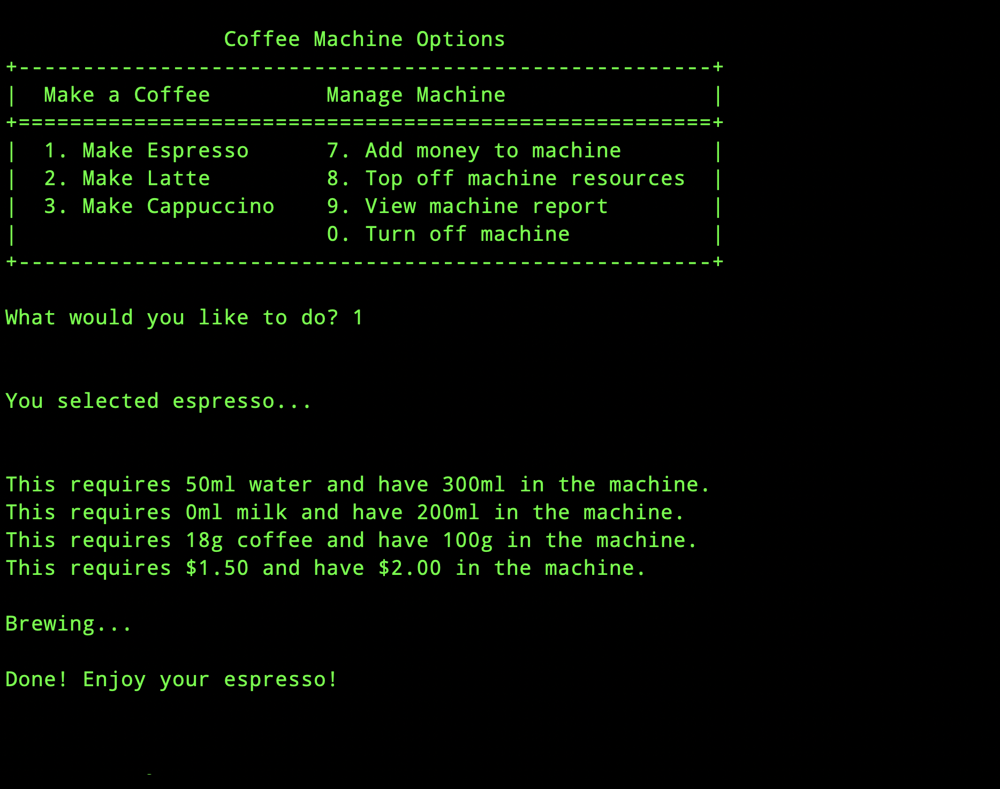
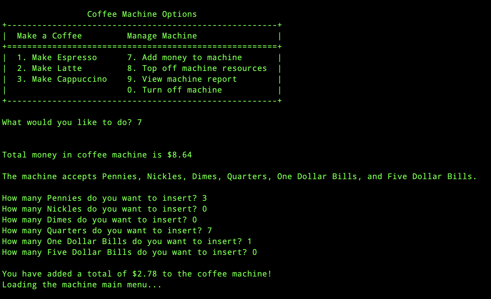

## Coffee Machine

This project is part of the "100 Days of Python" course. However, rather than simply following along with provided functionality or step-by-step instructions, I approached this project independently. I paused the course, designed and implemented the coffee machine from scratch, and only resumed the course after completing it on my own.

The program simulates a coffee machine that can prepare various coffee types based on user input. It incorporates features like resource management, handling monetary transactions, and displaying machine status, showcasing my ability to plan and execute a Python project without external guidance.


## Features

- Menu options for different types of coffee (espresso, latte, cappuccino)
- Tracks resources (water, milk, coffee, money)
- Allows the user to insert coins and bills into the coffee machine
- Provides a report of resources and money in the machine

## Screenshots

- Main Menu 
- Brewing a coffee 
- Adding money to the machine 

## Requirements

- Python 3.x

## How to Run

1. Clone the repository:
    ```bash
    git clone https://github.com/jason/100-days-of-python.git
    ```
2. Navigate to the coffee-machine directory:
    ```bash
    cd coffee-machine
    ```
3. Run the main Python script:
    ```bash
    python main.py
    ```
    